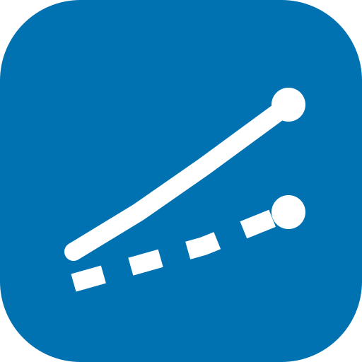
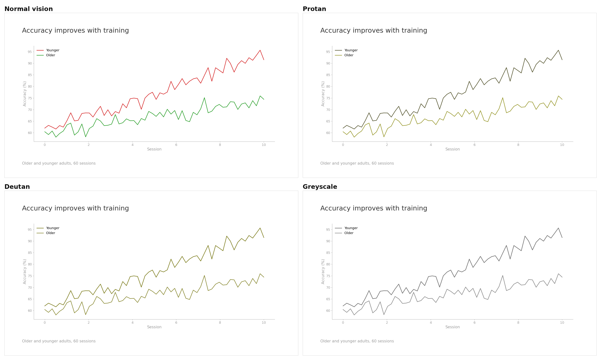
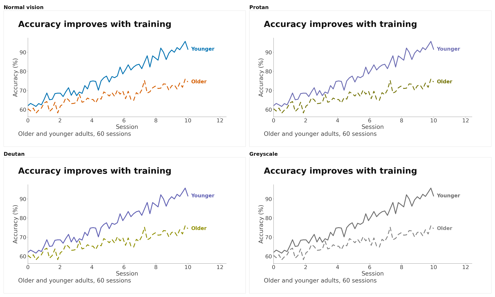

<p align="center">
  
</p>
<p align="center">
  <strong>Your slides look fine to you. You are not the one at the back of the room.</strong>
</p>
<p align="center">
  <a href="https://moecui22.github.io/accessible-slides/"></a>
  <a href="https://github.com/moecui22/accessible-slides/actions/workflows/test.yml"></a>
  <a href="LICENSE"></a>
  
  
</p>

Red line, green line, legend in the corner. Ships to a conference room. 📽️

About **1 in 12 men** in that room sees both lines in the same colour.

<h2 align="center">
  <a href="https://moecui22.github.io/accessible-slides/">👉 Drop a slide in here</a>
</h2>



Same slide, four ways of seeing it. Bottom left, both lines are the same colour
and the legend is useless.

Two changes fix it — colours that stay apart, and labels on the lines instead of
a legend:



## 👁️ What it measures

Nothing here is judged by eye. That is the whole point.

| Check | What it does | Why it is there |
|---|---|---|
| **Colour** 🎨 | Simulates each colour under protanopia and deuteranopia, then measures whether two colours that *mean* different things still *look* different | Red vs green almost never survives |
| **Contrast** 🌗 | Text against its background, with a stricter target for projectors than for screens | Room light washes out blacks — a slide always arrives worse than it looked on your laptop |
| **Text size** 📏 | Takes your screen height and the distance to the back row, returns the smallest readable font | This is where "use 30 point" comes from, except calculated instead of guessed |

Then it tells you what to change. Not just a score.

## 🎤 Who this is for

- Anyone giving a **conference talk** or **lecture** who has never checked what
  the back row sees
- **Poster presenters**, where the viewing-distance problem is worst
- Anyone making **figures for a paper**, especially with default matplotlib or
  ggplot colours
- People who have to **sign off on decks** for accessibility at work or school

You do not need to know anything about vision science. That part is handled.

## 💬 How to use it

Just say what you want:

> Check my talk deck for accessibility. The back row is about 12 m from a 2 m screen.

> Will these figure colours work for colour blind readers? #d62728 #2ca02c #1f77b4

> Is the text on this poster big enough to read from 3 m?

> Fix the colours in this chart so they work in greyscale.

If you do not say how big the room is, it will ask. The text-size answer means
nothing without it.

## 📦 Install

```bash
npx skills add moecui22/accessible-slides
```

That pulls the whole repo (~2 MB, demo assets and tests included). For just the
skill — 36 KB, nothing else:

```bash
npx skills add https://github.com/moecui22/accessible-slides/tree/main/plugins/accessible-slides/skills/accessible-slides
```

Claude Code, Cursor, other agents, or no agent at all: see
**[INSTALL.md](INSTALL.md)**.

## 🐍 No agent? The scripts work alone

```bash
# Which of these colours become confusable?
python3 scripts/audit.py --colors "#d62728,#2ca02c,#0072b2,#d55e00"

# Is this text readable, and what should it be?
python3 scripts/audit.py --contrast "#8a8a8a" "#ffffff"

# How big does text need to be in this room?
python3 scripts/audit.py --room --distance 15 --screen-height 2.0 --font 24
```

```
FAIL  #d62728 vs #2ca02c   normal 71.8 | protan 27.3 | deutan  5.0 | tritan 70.6
PASS  #0072b2 vs #d55e00   normal 49.6 | protan 55.2 | deutan 62.4 | tritan 78.4

Contrast #8a8a8a on #ffffff = 3.45:1
  projected, lit room (body)   need 7.0:1  FAIL
  nearest passing neutral      #595959 (7.00:1)

Your 24 pt text = 10.6 arcmin at the back row  [FAIL, need 41 pt]
```

`audit.py` needs nothing but Python 3. `simulate_cvd.py` needs `numpy` and `Pillow`.

> [!NOTE]
> **The browser demo is the same maths, not a rough port.** It re-implements
> `audit.py` in JavaScript, so it could drift and mislead exactly the people
> least likely to ever run the Python. CI extracts the maths out of the page on
> every push and checks it against the published reference values — identical on
> all seven, across contrast, dE2000 in three vision conditions, and both
> font-size directions.

## 🧭 How this differs from other tools

| Tool | Made for | Does not cover |
|---|---|---|
| axe, WAVE, Lighthouse | websites and web apps | slides, posters, figures |
| Colour blindness simulators | showing you a picture | measuring it, or telling you the fix |
| PowerPoint's built-in checker | alt text and reading order | colour, contrast, or size for the room |
| **accessible-slides** | slides, posters, figures | screen readers, alt text, reading order |

## 🙅 What it does not do

An accessibility tool that overpromises is worse than none:

- No screen reader checks, alt text, reading order or keyboard navigation. Those
  matter, and other tools cover them well.
- The contrast formula is the standard web one, known to fit light-on-dark and
  thin lines poorly.
- Colour blindness comes in degrees. The simulation shows the strongest form —
  treat it as a worst case, not a prediction.
- The colour separation threshold is a design choice, not a law of nature.
- It cannot tell you whether the slide was worth showing. 🙃

## 📚 Where the thresholds come from

- **CVD simulation:** Brettel, Viénot & Mollon (1997),
  [*JOSA A* 14(10), 2647](https://opg.optica.org/josaa/abstract.cfm?uri=josaa-14-10-2647)
  (doi:10.1364/JOSAA.14.002647), and Viénot, Brettel & Mollon (1999),
  [*Color Research & Application* 24(4), 243](https://onlinelibrary.wiley.com/doi/10.1002/%28SICI%291520-6378%28199908%2924:4%3C243::AID-COL5%3E3.0.CO;2-3)
- **Colour difference (CIEDE2000):** Sharma, Wu & Dalal (2005),
  *Color Research & Application* 30(1), 21 (doi:10.1002/col.20070).
  [Reference implementation and test data](https://www.ece.rochester.edu/~gsharma/ciede2000/)
- **Readable text size:** Legge & Bigelow (2011),
  [*Journal of Vision* 11(5):8](https://jov.arvojournals.org/article.aspx?articleid=2191906)
  (doi:10.1167/11.5.8)
- **Colour palette:** Okabe & Ito, [Color Universal Design](https://jfly.uni-koeln.de/color/)
- **Contrast ratios:** [WCAG 2.2](https://www.w3.org/TR/WCAG22/)

`tests/test_audit.py` checks the maths against published values from these, and
runs in CI. Using this in published work? There's a `CITATION.cff` and a
"Cite this repository" button in the sidebar.

## 📁 What's in here

| Path | What it is |
|---|---|
| `SKILL.md` | The operating procedure. Short by design. |
| `references/` | Thresholds, fixes, palettes and the vision science. Loaded only when needed. |
| `scripts/audit.py` | Contrast, colour separability, text size. Standard library only. |
| `scripts/simulate_cvd.py` | Image simulation and comparison sheets. |
| `docs/index.html` | The whole browser demo. One file, no build step. |
| `tests/` | The maths against published values, and the demo against the Python. |

## Also by me

**[spit-it-out](https://github.com/moecui22/spit-it-out)** — makes a coding agent
put the answer in the first line, without letting brevity delete or invent
anything. Blind-graded against the alternatives.

## Don't trust your own eyes

You have looked at that slide fifty times. You know where everything is, you
know which line is which, and you are eighteen inches from a bright screen.

You are the one person in the building who cannot tell whether it works. 👓

MIT
